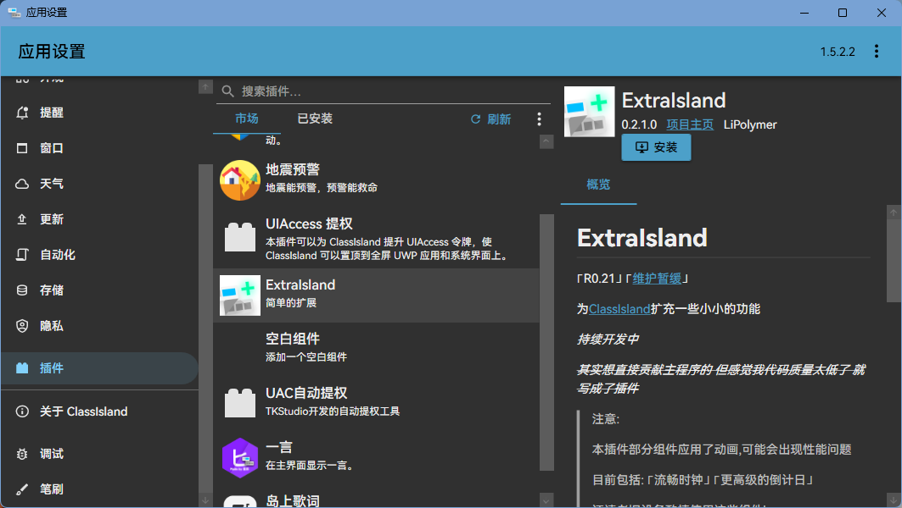
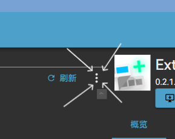

> [!IMPORTANT] 写在之前 · ≧ ﹏ ≦
>
> 由于备考压力，[维护暂停](https://lipoly.ink/2024/announcement/)，届时开发将几乎停止，还请见谅 😭🙏
>
> 本项目将于 [`#21`](https://github.com/LiPolymer/ExtraIsland/issues/21) 实现后暂停开发,并在高考结束后恢复
>
> 当然,如果你觉得这个项目不错，欢迎Star，也可以为本项目创建 PullRequest 来帮助我们变得更好！
>
> 再次感谢大家的喜爱和使用！😋🙏 祝大家学业有成

# 快速开始

欢迎使用 ExtraIsland！要开始使用,首先需要 __安装__ 本插件

## 自动安装
ExtraIsland已经上架ClassIsland插件市场!

__推荐通过插件市场进行安装!__
## 手动安装
由于一些特殊原因,或是需要使用尝鲜版功能,可能需要进行手动安装:
### 获取安装包
安装包即为 `*.cipx` 文件
#### 稳定版本
- 前往 [`GitHub`](https://github.com/LiPolymer/ExtraIsland/releases/)/[`Gitlab`](https://gitlab.com/LiPolymer/ExtraIsland/-/releases) Release
- 选取最新的Release
- 下载 `ink.lipoly.ext.extraisland.cipx`
> [!TIP]
> 如果担心下载到的插件文件被修改,可以验证MD5值
#### 尝鲜版本
> [!CAUTION]
> （；´д｀）ゞ 稍等一下!
> 
> 尝鲜版本包含最新修改,但是可能也包含最新Bug!
> 
> 不推荐安装到班级电脑,未正确处理的Bug可能危害教学秩序!
- 前往 [`Gitlab Pipelines`](https://gitlab.com/LiPolymer/ExtraIsland/-/pipelines)
- 选取最新的 Pipeline
- 点击右侧对应下载按钮,选择 `buildjob:archive`
- 将下载到的 `artifacts.zip` 解压
- 进入文件夹,导航到`ExtraIsland > bin > Release > net8.0-windows`
- 选中其中所有文件,压缩为zip
- 将得到的压缩包扩展名修改为 `.cipx`
### 安装
- 打开 ClassIsland 设置面板
- 切换到 `插件` 页面
- 点击中部三点菜单 
- 选择 `从本地安装...`
- 选择刚才获取到的`*.cipx`文件,确定