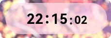
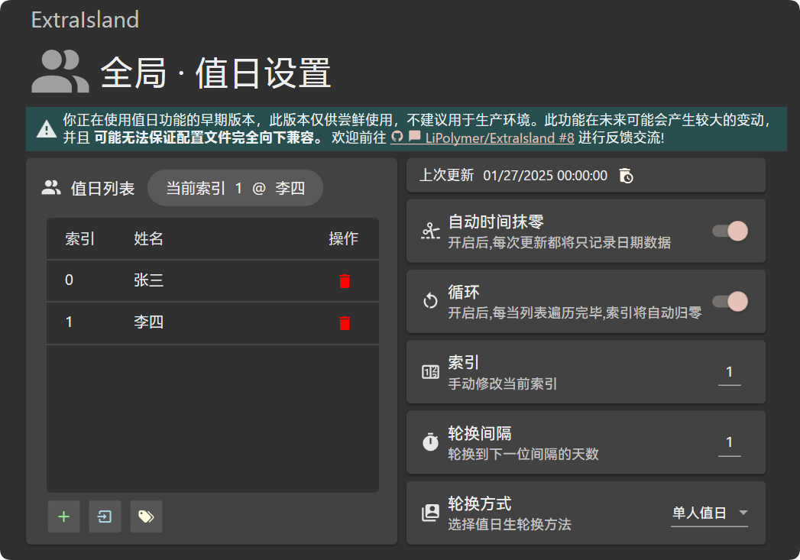

<!--markdownlint-disable MD033 MD036-->

# ExtraIsland

**✨「课岛进化」** ✨

[ExtraIsland](https://docs.lipoly.ink/ExtraIsland) 是一款 [ClassIsland](https://classisland.tech/) 的实用插件，为 ClassIsland 增加了更好的倒计日、流畅时钟、名句一言、值日表等组件功能。诸多新功能，如换届导引、Sleepy 组件等亦处于绝赞开发中。

> [!IMPORTANT]
>
> 由于备考压力，[维护暂缓](https://lipoly.ink/2024/announcement/)，部分问题可能无法及时处理，还请见谅 😭🙏
>

为 [ClassIsland](https://classisland.tech/) 扩充一些小小的功能

🧐 最新 commit 尝鲜可以前往 [GitLab Pipeline](https://gitlab.com/LiPolymer/ExtraIsland/-/pipelines) 获取 [未打包](https://docs.classisland.tech/dev/plugins/publishing.html#%E6%89%93%E5%8C%85%E6%8F%92%E4%BB%B6) 的构建

_持续开发中_

本项目处于起步阶段 ☝🤓

欢迎大家在 Issues 提交**功能请求**,帮我把这个项目变得更好!🤗

_~~其实想直接贡献主程序的 但感觉我代码质量太低了 就写成了插件~~_

_也算是以前写的班级小工具的精神续作(?_

> [!IMPORTANT]
>
> 本插件的部分组件应用了动画效果。动画效果在部分较旧的设备上可能引发性能问题，请用户酌情启用插件的动画效果。
>
> **目前使用动画效果的组件**：「流畅时钟」、「更好的倒计时」。
>

**感谢同学们对本项目的支持与贡献！**

## 完成的功能

### 流畅时钟

- 时钟有切换和闪动动画

- 可关闭秒数显示，或使用小字体显示秒数

- 从准确时间服务获取时间，或获取 Windows 时间

- 整点强调动画

### 更好的倒计日

- 倒计时可精确到秒

- 有切换动画

- 可配置倒计时文本

- 从准确时间服务获取时间，或获取 Windows 时间

- 更好的配置面板

### 值日表

- 三种轮换方式

- 轮换间隔设定

- 简便的名单管理，可从文本文档中导入值日生名单

- 自动整理索引排序

- (实验性) 自动循环

### 名句一言

- 支持三个 API，且 API 可配置

- 自动刷新

- 自定义请求

- (早期 · 当前仅一言 API 支持) 字数限制

## 高可用的实验性功能（需获取 [自动构建](https://gitlab.com/LiPolymer/ExtraIsland/-/pipelines)）

- 更好的倒计日

  - 关闭动画

- 微功能

  - 导引界面：为接手智能白板的下一届同学们留下 ClassIsland 等工具的使用导引！

- 生活模式:

  - Sleepy 组件

## 正在开发的功能

- 弹出式提醒

- 名句一言

  - 本地语句源

  - 切换动画
